# Types of Components
Components are user interface elements that can be used in different places, such as [items](document.md#user-content-body-sections-items), and [layers](document.md#user-content-body-layers).

- [label](#label)
- [image](#image)
- [button](#button)
- [textfield](#textfield)
- [textarea](#textarea)
- [slider](#slider)
- [html](#html)
- [space](#space)
- [map](#map)
- Don't see what you want? [You can add more!](advanced.md#extension)

---

##■ label

Static uneditable text element.

###syntax

  - `type`: `"label"`
  - `text`: The text to display
  - `style`:
    - `font`: [text font name](http://iosfonts.com)
    - `size`: text size
    - `color`: text color in color code
    - `padding`: padding in pixels
    - `background`: background color of the label in color code
    - `corner_radius`: corner radius for the label

###example

    {
      "type": "label",
      "text": "Hello world",
      "style": {
        "font": "Avenir",
        "size": "30",
        "color": "rgb(200,0,0)",
        "padding": "10"
      }
    }

---

##■ image

Image loaded from either remote url or data-url

---

> ** ⚠️ Disclaimer:**
>
>**image components are NOT Interactive. To attach `action` or `href` to make an image interactive, use [image buttons](#button)**

---

 

###syntax

  - `type`: `"image"`
  - `url`: image url
  - `header`: (optional) in case the image needs authentication and we need to attach a header object to the request
  - `style` (optional)
    - `corner_radius`: corner radius. use this to make the image rounded
    - `width`
    - `height`
    - `color`: To set the tint color (only for icons)

 

###example

    {
      "type": "image",
      "url": "http://i.imgur.com/KUJPgGV.png",
      "header": {
      	"auth_token": "3nfdss3fNdlenghs_dnekgldnvq334hd"
      },
      "style": {
        "width": "50",
        "height": "50",
        "corner_radius": "25"
      }
    }

---

##■  button
A basic component that responds to user tap.

Can be either a text button or an image button, depending on what attributes are used.

 

###syntax

  - `type`: `"button"`
  - `text`: button text (pick either `text` or `url`, can't have both)
  - `url`: button image url (pick either `text` or `url`, can't have both)
  - `header`: (optional) in case the we're using the image button and the image needs authentication and we need to attach a header object to the request
  - `style`
    - `width`: Width of the clickable region (In case of image buttons, the image will auto-resize proportionally to fit into this region)
    - `height`: Height of the clickable region (In case of image buttons, the image will auto-resize proportionally to fit into this region)
    - `color`: text color
    - `background`: background color
    - `color`: To set the tint color (only for icons)
    - `corner_radius`: corner radius for the button
    - `padding`: padding outside of the text (in case of text button) or outside of the image (in case of image button). Note that the height and width will stay the same regardless of what padding value you set.
    - `align`: Only for text buttons. You can set it as `left`, `right`, or `center`. The default is `center`. (Irrelevant on image buttons since image buttons will always be centered)
  - [action](/actions) : Attach an action attribute to be triggered when user taps the button.

 

###Example

**Text button**

Use `text` attribute to make it a label button

    {
      "type": "button",
      "text": "Tap Me!",
      "style": {
        "width": "50",
        "height": "50",
        "background": "#00ff00",
        "color": "#ffffff",
        "font": "HelveticaNeue",
        "size": "12",
        "corner_radius": "25"
      },
      "action": {
        "trigger": "reload"
      }
    }

**Image button**

Use `url` attribute to make it an image button

    {
      "type": "button",
      "url": "https://raw.githubusercontent.com/Jasonette/Jasonpedia/gh-pages/assets/krusty.png",
      "header": {
      	"auth_token": "3nfdss3fNdlenghs_dnekgldnvq334hd"
      },
      "style": {
        "width": "50",
        "height": "50",
        "background": "#00ff00",
        "color": "#ffffff",
        "font": "HelveticaNeue",
        "size": "12",
        "corner_radius": "25"
      },
      "action": {
        "trigger": "reload"
      }
    }

---

##■ textfield

Single line input field

 

textfields are seamlessly integrated with [local variables](actions.md#local-variable)

### syntax

  - `name`: name of the local variable to set.
  - `value`: in case you wish to prefill the field.
  - `placeholder`: Placeholder text for when there's no content filled in.
  - `keyboard`: The keyboard type. One of the following: `"text"` | `"number"` | `"phone"` | `"url"` | `"email"` (if unspecified, the default is `"text"`)
  - `style`: style the textfield
    - `background`
    - `align`
    - `autocorrect`: set to `"true"` to enable autocorrect
    - `autocapitalize`: set to `"true"` to enable autocapitalize
    - `spellcheck`: set to `"true"` to enable spellcheck
    - `size`: text size
    - `font`: text font
    - `color`: text color
    - `placeholder_color`: placeholder text color
    - `secure:` hide character input if set to `"true"`

### examples
####Example 1: password input

    {
      "type": "textfield",
      "name": "password",
      "value": "dhenf93f!",
      "placeholder": "Enter password",
      "style": {
        "placeholder_color": "#cecece",
        "font": "HelveticaNeue",
        "align": "center",
        "width": "200",
        "height": "60",
        "secure": "true",
        "size": "12"
      }
    }

####Example 2: autocorrect/autocaptiazlie/spellcheck input

    {
      "type": "textfield",
      "name": "status",
      "placeholder": "Status update",
      "style": {
        "placeholder_color": "#cecece",
        "font": "HelveticaNeue",
        "align": "center",
        "width": "200",
        "height": "60",
        "autocorrect": "true",
        "autocapitalize": "true",
        "spellcheck": "true",
        "size": "12"
      }
    }

---

##■ textarea

Multiline input field

  - `name`: name of the local variable to set.
  - `value`: in case you wish to prefill the field.
  - `placeholder`: Placeholder text for when there's no content filled in.
  - `keyboard`: The keyboard type. One of the following: `"text"` | `"number"` | `"phone"` | `"url"` | `"email"` (if unspecified, the default is `"text"`)
  - `style`: style the textfield
    - `background`
    - `align`: `"left"` | `"center"` | `"right"` (default is `"left"`)
    - `autocorrect`: set to `"true"` to enable autocorrect
    - `autocapitalize`: set to `"true"` to enable autocapitalize
    - `spellcheck`: set to `"true"` to enable spellcheck
    - `size`: text size
    - `font`: text font
    - `color`: text color
    - `placeholder_color`: placeholder text color

### example
Below, we've named the textarea `status`, and then refer to its value from `submit` action through the template expression `{{$get.status}}`

<pre>{
  "$jason": {
    "head": {
      "actions": {
        ...
        "submit": {
          "type": "$network.request",
          "options": {
            "url": "https://stts.jasonclient.org/status.json",
            "method": "post",
            "data": {
              "content": "{{$get.status}}"
            }
          },
          "success": {
            "type": "$reload"
          }
        }
        ...
      }
    },
    "body": {
      ...
      {
        "type": "textarea",
        "name": "status",
        "placeholder": "Status update",
        "value": "Eating lunch..",
        "style": {
          "background": "rgba(0,0,0,0)",
          "placeholder_color": "#cecece",
          "font": "HelveticaNeue",
          "align": "center",
          "width": "100%",
          "height": "300",
          "autocorrect": "true",
          "autocapitalize": "true",
          "spellcheck": "true",
          "size": "12"
        }
      }
      ...
    }
  }
}</pre>

---

##■ slider

Horizontal slider input

### syntax

  - `name`: name of the local variable to set.
  - `value`: value between 0 and 1 (in string) to preset the slider with. For example `"0.3"`
  - `action`: [action](actions.md) to execute after user completes the sliding gesture.
  - `style`
    - `width`
    - `height`
    - `color`

###example
Below, we set the slider's name `gauge` and triggers the `notice` action, which accesses its value whenever the user ends the sliding action.

<pre>{
  "$jason": {
    "head": {
      ...
      "notice": {
        "type": "$util.alert",
        "options": {
          "title": "Volume changed",
          "description": "{{parseFloat($get.gauge)*100}}%"
        }
      }
      ...
    },
    "body": {
      ...
      {
        "type": "slider",
        "name": "gauge",
        "action": {
          "trigger": "notice"
        }
      }
      ...
    }
  }
}</pre>

---

 
 

##■  html

A self-contained web environment that you can plug in, style, and manipulate just like the rest of the components.

To learn more, refer to [Web containers](web.md).

 

 
 

---

##■  space

An empty space component mostly used for layout purposes.

### syntax

  - `style`
    - `background`: background color (transparent if not specified)
    - `width`: only specify if you want a horizontally fixed size space
    - `height`: only specify if you want a vertically fixed size space

### Example 1. Flexible size space
If you don't specify the style, the space component will contract or expand flexibly depending on its surrounding sibling components.

This is useful for when you wish to make special alignments, such as aligning one component to the left, and the other to the right in a horizontal layout.

<pre>{
  "type": "horizontal",
  "components": [
    {
      "type": "image",
      "url": "https://jasonclient.org/img/john.png",
      "style": {
        "width": "50"
      }
    }, 
    {
      "type": "space"
    },
    {
      "type": "button",
      "text": "Follow"
      "style": {
        "width": "100",
        "height": "50"
      }
    }
  ]
}</pre>

### Example 2. Fixed size space

You can also set the size of a space component.

<pre>{
  "type": "vertical",
  "components": [
    {
      "type": "image",
      "url": "https://jasonclient.org/img/john.png",
      "style": {
        "width": "50"
      }
    }, 
    {
      "type": "space",
      "style": {
        "height": "50"
      }
    },
    {
      "type": "label",
      "text": "The names 'John Doe' or 'John Roe' for men, 'Jane Doe' or 'Jane Roe' for women, or 'Johnnie Doe' and 'Janie Doe' for children, or just 'Doe' non-gender-specifically are used as placeholder names for a party whose true identity is unknown or must be withheld in a legal action, case, or discussion."
    }
  ]
}</pre>

---

##■  map

Map component

### syntax

####• `type`: `"map"`
####• `region`: Describes the region this map component will draw. 
  - `coord`: Coordinate string in `LATITUDE,LONGITUDE` format, around which the map should be centered. (example: `"40.7146598,-73.9418602"`)
  - `width`: The width in meters in terms of how wide the map region should be
  - `height`: The height in meters in terms of how wide the map region should be

####• `pins`: Array of pin objects. Each pin contains the following attributes:
  - `coord`: Coordinate string in `LATITUDE,LONGITUDE` format. (example: `"40.7146598,-73.9418602"`)
  - `title`
  - `description`
  - `style`
    - `selected`: display the annotation by default even when not tapped.

####• `style`: Styling of the component itself
  - `type`: `"satellite"` | `"hybrid"` | `"hybrid_flyover"` | `"satellite_flyover"`
  - `width`: width of the component to display
  - `height`: height of the component to display
  - `corner_radius`: corner radius of the component

### Example

    {
      "type": "map",
      "region": {
        "coord": "40.7197614,-73.9909211",
        "width": "100",
        "height": "100"
      },
      "pins": [{
        "title": "This is a pin",
        "description": "It really is.",
        "coord": "40.7197614,-73.9909211",
        "style": {
          "selected": "true"
        }
      }],
      "style": {
        "width": "100%",
        "height": "300"
      }
    }

### Permissions and API Keys

On iOS the map component works right out of the box using Apple's native map.

However on Android you need to set it up using Google Maps API.

1. Just open up `AndroidManifest.xml` file from Android Studio.
2. Uncomment the lines described below:
3. And add your Google Maps API Key (You can get it from [here](https://developers.google.com/maps/))

 

# Types of Components - EBF Additions

- [toggle](#toggle)
- [radiobuttons](#radiobuttons)
- [checkboxes](#checkboxes)
- [dropdown](#dropdown)
- [datepicker](#datepicker)
- [datetimepicker](#datetimepicker)
- [numberfield](#numberfield)
- [pager](#pager)

##■ toggle

Toggle (Switch) view to display a boolean value. The label is always Yes or No (internationalized on the client). The value must be `"0"` (No) or `"1"` (Yes).

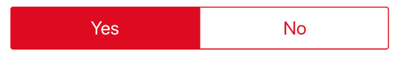

###syntax

  - `type`: `"toggle"`
  - `name`: name of the local variable to set.
  - `value`: `"0"` or `"1"`
  - `style`:
    - `size`: text size
    - `color`: color in color code (applies to background and border, complimentary color is always transparent, so that the background "shines" through)
    - `padding`: padding in pixels around the entire component
    
###example

    {
      "type": "toggle",
      "name": "someFieldName",
      "value": "true",
      "style": {
        "size": "30",
        "color": "rgb(200,0,0)",
        "padding": "10"
      }
    }

---

##■ radiobuttons

Displays a set of buttons, of which only one button can be selected at once. The selected button is highlighted.

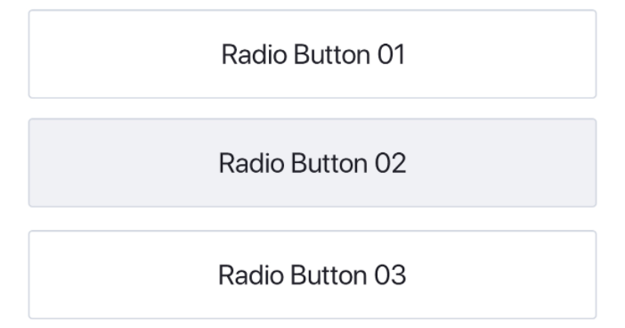

###syntax

  - `type`: `"radiobuttons"`
  - `name`: name of the local variable to set.
  - `options`: an array of option objects, each of which contains a label, a value and defaultSelected property
  - `style`:
    - `size`: text size
    - `color`: text color in color code
    - `padding`: padding in pixels around the entire component
    
###example

    {
      "type": "radiobuttons",
      "name": "someFieldName",
      "options": [
        {
          "label": "Radio Button 01",
          "value": "Value 1",
          "defaultSelected": "false"
        },
        {
          "label": "Radio Button 02",
          "value": "Value 2",
          "defaultSelected": "true"
        },
        {
          "label": "Radio Button 03",
          "value": "Value 3",
          "defaultSelected": "false"
        }
      ],
      "style": {
        "size": "30",
        "color": "rgb(200,0,0)",
        "padding": "10"
      }
    }

---

##■ checkboxes

Displays a set of buttons each containing a checkbox and a label. Multiple buttons can be selected at the same time.

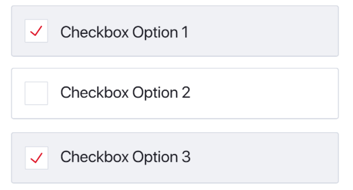

###syntax

  - `type`: `"checkboxes"`
  - `name`: name of the local variable to set.
  - `options`: an array of option objects, each of which contains a label, a value and defaultSelected property
  - `style`:
    - `size`: text size
    - `color`: text color in color code
    - `padding`: padding in pixels around the entire component
    
###example

    {
      "type": "checkboxes",
      "name": "someFieldName",
      "options": [
        {
          "label": "Checkbox Option 1",
          "value": "Value 1",
          "defaultSelected": "true"
        },
        {
          "label": "Checkbox Option 2",
          "value": "Value 2",
          "defaultSelected": "false"
        },
        {
          "label": "Checkbox Option 3",
          "value": "Value 3",
          "defaultSelected": "true"
        }
      ],
      "style": {
        "size": "30",
        "color": "rgb(200,0,0)",
        "padding": "10"
      }
    }

---

##■ dropdown

Displays a dropdown element. When the user taps the element, a list of options is presented to the user. The user may select only one option at a time.

*DropDown element before selection*
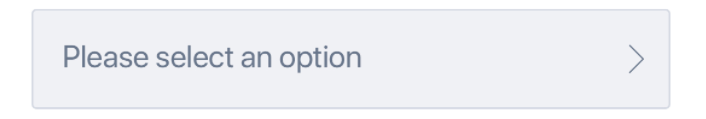

*DropDown selection slideout*
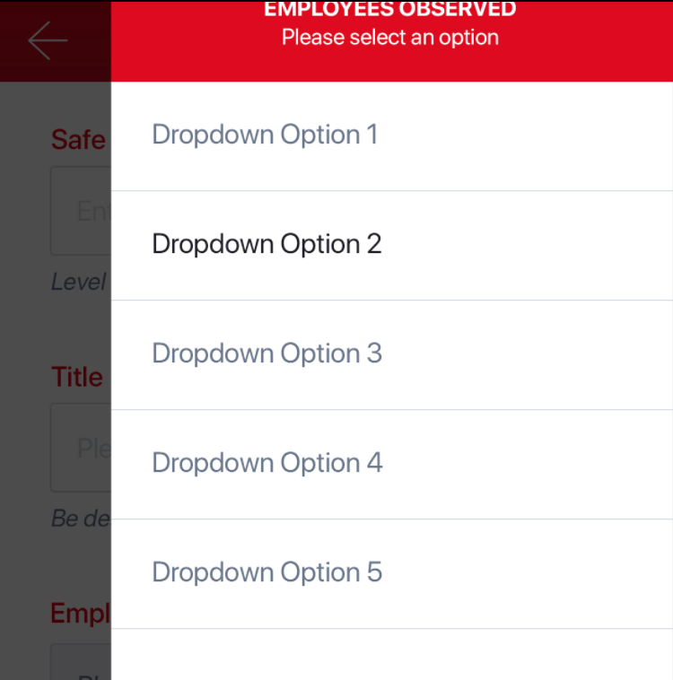

*DropDown element after selection (or when defaultValue is set)*
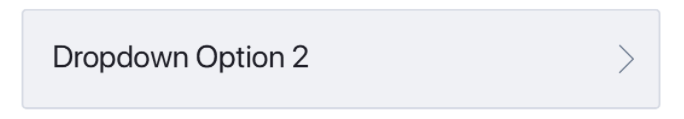

###syntax

  - `type`: `"dropdown"`
  - `name`: name of the local variable to set.
- `options`: an array of option objects, each of which contains a label, a value and defaultSelected property
  - `style`:
    - `size`: text size
    - `color`: text color in color code
    - `padding`: padding in pixels around the entire component
    
###example

    {
      "type": "dropdown",
      "name": "someFieldName",
      "options": [
        {
          "label": "Dropdown Option 1",
          "value": "Value 1",
          "defaultSelected": "false"
        },
        {
          "label": "Dropdown Option 2",
          "value": "Value 2",
          "defaultSelected": "true"
        },
        {
          "label": "Dropdown Option 3",
          "value": "Value 3",
          "defaultSelected": "false"
        }
      ],
      "style": {
        "size": "30",
        "color": "rgb(200,0,0)",
        "padding": "10"
      }
    }

---

##■ datepicker

Date Picker view. Allows the user to select a date without time.

TODO: @ogy: replace these ugly ass images

*datepicker component before selection*
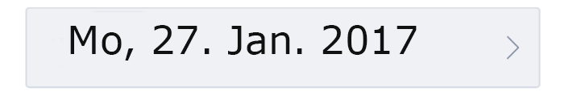

*datepicker component upon selection*
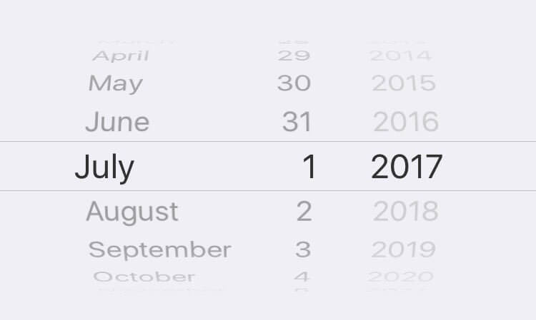

###syntax

  - `type`: `"datepicker"`
  - `name`: name of the local variable to set.
  - `defaultValue`: `ISO8601 compliant date`
  - `style`: (applies to datepicker component before selection only)
    - `size`: text size
    - `color`: color in color code (applies to background and border, complimentary color is always transparent, so that the background "shines" through)
    - `padding`: padding in pixels around the entire component
    
###example

    {
      "type": "datepicker",
      "name": "someFieldName",
      "defaultValue": "2017-01-30T00:00:00Z",
      "style": {
        "size": "30",
        "color": "rgb(200,0,0)",
        "padding": "10"
      }
    }

    ---

##■ datetimepicker

DateTime Picker view. Allows the user to select a date and time.

TODO: @ogy: replace these ugly ass images

*datetimepicker component before selection*

*datetimepicker component upon selection*
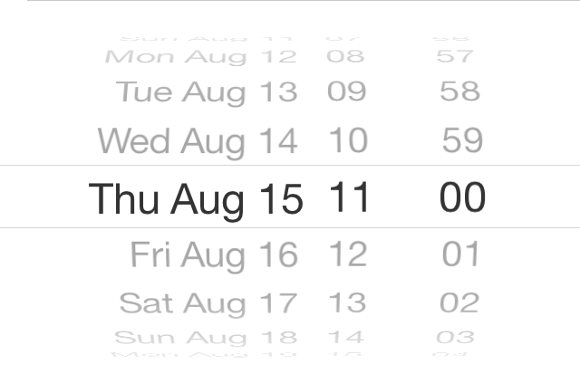

###syntax

  - `type`: `"datetimepicker"`
  - `name`: name of the local variable to set.
  - `defaultValue`: `ISO8601 compliant date`
  - `style`: (applies to datetimepicker component before selection only)
    - `size`: text size
    - `color`: color in color code (applies to background and border, complimentary color is always transparent, so that the background "shines" through)
    - `padding`: padding in pixels around the entire component
    
###example

    {
      "type": "datetimepicker",
      "name": "someFieldName",
      "defaultValue": "2017-01-30T00:00:00Z",
      "style": {
        "size": "30",
        "color": "rgb(200,0,0)",
        "padding": "10"
      }
    }

---

##■ numberfield

Component to display and edit number values

TODO: @ogy: design number fields

###syntax

  - `type`: `"numberfield"`
  - `name`: name of the local variable to set.
  - `defaultValue`: optional default number
  - `placeholder`: optional placholder number to display if field is empty
  - `minimumValue`: optional minimum number the user is allowed to enter
  - `maximumValue`: optional maximum number the user is allowed to enter
  - `style`:
    - `size`: text size
    - `color`: color in color code
    - `padding`: padding in pixels around the entire component
    
###example

    {
      "type": "numberfield",
      "name": "someFieldName",
      "defaultValue": "5",
      "placeholder": "1",
      "minimumValue": "1",
      "maximumValue": "10",
      "style": {
        "size": "30",
        "color": "rgb(200,0,0)",
        "padding": "10"
      }
    }

---

##■ pager

Component that allows the user to switch between different pages of components by swiping left and right

*pager component*

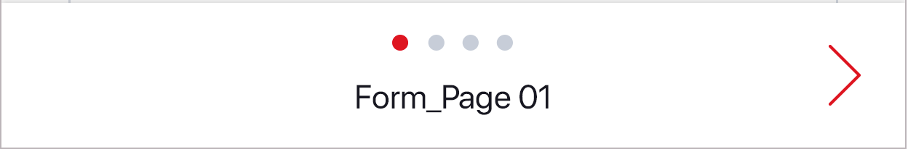

*pager component with position `"bottom"`*

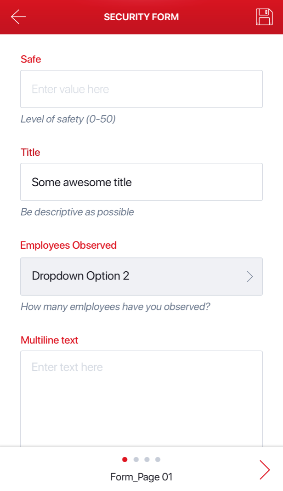

###syntax

  - `type`: `"pager"`
  - `position`: `"top"` or `"bottom"`
  - `pages`: array of pages that contain a name and a components property each
    
###example

    {
      "type": "pager",
      "pages": [
        {
          "name": "Form_Page 01",
          "components": [

          ]
        },
        {
          "name": "Page 2",
          "components": [

          ]
        },
      ]
    }